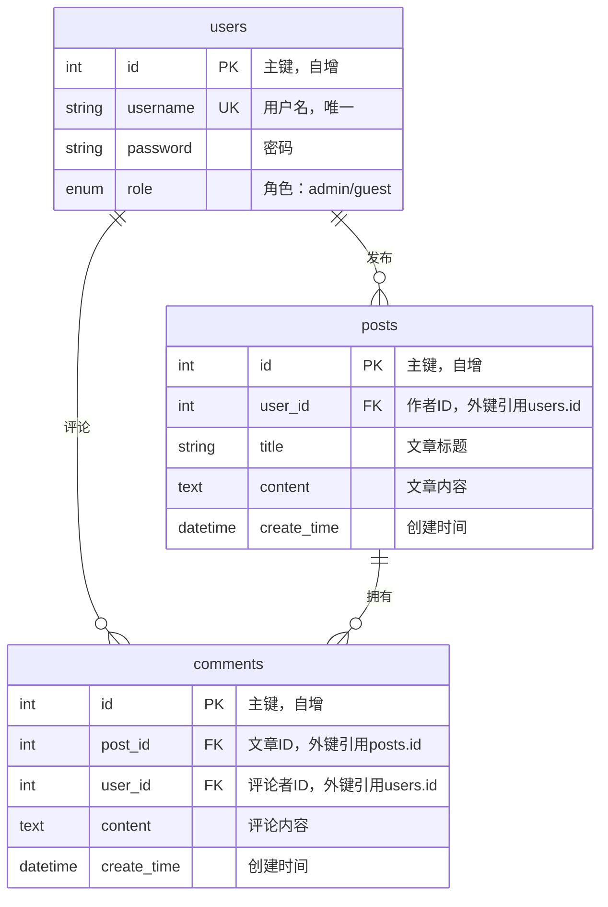

# 博客系统数据库 ER 图

## Mermaid ER 图

## 数据库表结构说明

### 1. users（用户表）
- **id**: 主键，自增整数
- **username**: 用户名，唯一约束，最大长度50字符
- **password**: 密码，最大长度50字符
- **role**: 用户角色，枚举类型（'admin' 或 'guest'），默认为 'guest'

### 2. posts（文章表）
- **id**: 主键，自增整数
- **user_id**: 外键，引用 users.id，级联删除
- **title**: 文章标题，最大长度100字符
- **content**: 文章内容，文本类型
- **create_time**: 创建时间，日期时间类型

### 3. comments（评论表）
- **id**: 主键，自增整数
- **post_id**: 外键，引用 posts.id，级联删除
- **user_id**: 外键，引用 users.id，级联删除
- **content**: 评论内容，文本类型
- **create_time**: 创建时间，日期时间类型

## 关系说明

1. **users → posts**: 一对多关系
   - 一个用户可以发布多篇文章
   - 外键约束：posts.user_id → users.id
   - 删除策略：CASCADE（删除用户时，其文章也会被删除）

2. **users → comments**: 一对多关系
   - 一个用户可以发表多条评论
   - 外键约束：comments.user_id → users.id
   - 删除策略：CASCADE（删除用户时，其评论也会被删除）

3. **posts → comments**: 一对多关系
   - 一篇文章可以有多条评论
   - 外键约束：comments.post_id → posts.id
   - 删除策略：CASCADE（删除文章时，其评论也会被删除）

